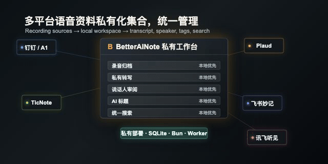

<sub>🌐 <a href="README.md">简体中文</a> · <b>English</b> · <a href="README.ja.md">日本語</a> · <a href="README.ko.md">한국어</a></sub>

<div align="center">

# BetterAINote 🎙️

> *"Your recordings are scattered across platforms. You want one private workspace you can trust and keep."*

<a href="https://github.com/MapleEve/BetterAINote/actions/workflows/ci.yml">
  
</a>
<a href="https://github.com/MapleEve/BetterAINote/releases">
  
</a>
<a href="./docs/DEPLOYMENT.md">
  
</a>
<a href="./LICENSE">
  
</a>

<br>
<br>



<br>

Bring voice records from DingTalk / A1, TicNote, Plaud, Feishu Minutes, iFLYTEK iFlyrec, and similar sources into one local workspace.<br>
The focus is private aggregation and unified management across recording platforms, not one vendor identity.<br>
Recordings, transcripts, speaker review, AI titles, source reports, and search-ready metadata stay around your own deployment first.<br>
Current version: `0.6.0-preview`. Self-hosting first. No npm package or public Docker image is published.

<br>

[Quickstart](#get-started) · [AI install/deploy](./docs/AI_INSTALL_DEPLOYMENT.md) · [Data sources](./docs/DATA_SOURCES.md) · [API](./docs/API.md) · [Deployment](./docs/DEPLOYMENT.md) · [Privacy](./docs/PRIVACY.md)

</div>

---

## Sound familiar?

> Meeting recordings live in different vendor consoles. Titles are inconsistent, downloads work differently, and finding one meeting means jumping across several websites.

> Transcription, renaming, speaker cleanup, and source notes each use a different tool. You are not always sure where credentials, audio, database rows, and logs end up.

BetterAINote fixes that. **It brings multi-source recordings into a private workspace where sync, archiving, private transcription, speaker review, AI renaming, and search preparation are built around your local data.**

---

## Who it is for

- People already using DingTalk / A1, TicNote, Plaud, Feishu Minutes, iFLYTEK iFlyrec, or similar recording platforms.
- Users who want their recording library, SQLite databases, service credentials, and audio archive on machines or servers they control.
- Teams that want VoScript or another private transcription service instead of sending every recording through a third-party cloud pipeline.
- Developers who want a self-hosted baseline before connecting more workflows or private automation.

BetterAINote is an independent project. Plaud is one supported source, not the product identity.

---

## Current status

| Area | Status |
| --- | --- |
| Stage | `preview`, built for self-hosters and early feedback |
| Release | `0.6.0-preview` is the preview baseline; stable release, npm package, and public Docker image are not published |
| Package | `package.json` remains `private: true` |
| Deployment | Local machine, home server, private server, or container environment you control |
| Compatibility | API shape, provider capability, and settings may still change before the first stable release |

---

## Get started

```bash
bun install
cp .env.example .env.local
bun run db:migrate
bun run dev
```

`bun run dev` starts both the Next.js web app and the background worker. Use `bun run dev:web` for web only, or `bun run worker` when you need to run the worker separately.

Open `http://localhost:3001`, create the first admin account, then configure:

- `Data Sources`: connect DingTalk, TicNote, Plaud, Feishu Minutes, iFLYTEK iFlyrec, and similar recording sources.
- `VoScript`: configure your private transcription service URL and API key.
- `Transcription`: set shared transcription behavior.
- `AI Rename`: configure title generation and source write-back behavior.
- `Sync` / `Playback` / `Display`: tune sync, playback, and interface preferences.

Do not commit `.env.local`, databases, audio archives, account screenshots, or real credentials.

Full setup details: [Deployment](./docs/DEPLOYMENT.md)

---

## What you get

**Unified recording workspace**

- Multi-source recordings in one local library.
- Organize by source, title, time, transcript state, sync state, and tags.
- Local audio archive backed by your disk or mounted storage.

**Private transcription and speaker review**

- Connect VoScript or another private transcription service.
- Review transcript state, local transcript output, speaker labels, and reusable speaker profiles.
- Keep source records, private transcripts, and AI-generated titles in separate lanes.

**Search-ready storage baseline**

- SQLite shards for core settings, recording library, transcripts, voiceprints, word timing, and a rebuildable search sidecar.
- Search baseline covers recordings, transcripts, speakers, and tags.
- Preview migrations are squashed into shard baselines so future migrations have a stable source of truth.

**Safe source report surface**

- `source-report` returns a user-facing, sanitized shape for UI and troubleshooting.
- It does not return upstream raw responses, auth fields, signed download URLs, cookies, user identifiers, or full request context.

---

## Supported sources

| Source | User-facing status |
| --- | --- |
| DingTalk / A1 | Syncs accessible recordings with the credentials configured in settings. Source detail, audio, and summary availability depend on the account. |
| TicNote | Supports China / international regions. Can sync records, archive available audio, and attempt title write-back when enabled. |
| Plaud | Supported as a recording source. Can sync records, archive available audio, and attempt title write-back when enabled. |
| Feishu Minutes | Can inspect or sync source metadata, transcripts, and summaries when account permissions allow. |
| iFLYTEK iFlyrec | Focused on transcript record import and review. Audio and write-back depend on what the source exposes. |

Providers do not expose identical fields or capabilities. See [Data Sources](./docs/DATA_SOURCES.md).

---

## Local development

```bash
bun run dev          # Next.js app + background worker
bun run dev:web      # Next.js app only
bun run worker       # background worker only
bun run type-check
bun run format-and-lint
bun run test
```

Runtime shape:

- `app`: Next.js Web UI and API routes.
- `worker`: background sync checks, transcription dispatch, and queue work.
- `SQLite`: separated databases for core settings, library, transcripts, voiceprints, word timing, and search.
- `storage`: local audio archive.

Keep provider sync, transcription services, title generation, search, and UI preferences separated. No single recording source should become the default mental model for the whole app.

---

## Privacy and security

BetterAINote can contain recording titles, source records, transcripts, speaker names, audio files, credentials, and service keys. Treat the deployment as private infrastructure.

- Local SQLite files and `LOCAL_STORAGE_PATH` may contain sensitive recording and transcript data.
- Provider credentials, VoScript credentials, AI title service keys, and session state should stay inside your private deployment.
- Logs, issues, pull requests, screenshots, and recordings must be sanitized before public sharing.
- Do not publish cookies, bearer tokens, org/user/recording IDs, meeting content, capture files, full environment files, or local private paths.
- Before exposing the panel beyond your own machine, use strong random `BETTER_AUTH_SECRET` / `ENCRYPTION_KEY` values and put the app behind your own network boundary, TLS, and access control.

See [Privacy](./docs/PRIVACY.md) and [Security](./SECURITY.md).

---

## Documentation

| Topic | Link |
| --- | --- |
| Project overview | [README.en.md](./README.en.md) |
| AI install/deploy | [docs/AI_INSTALL_DEPLOYMENT.md](./docs/AI_INSTALL_DEPLOYMENT.md) |
| API shape and public boundary | [docs/API.md](./docs/API.md) |
| Data source maturity | [docs/DATA_SOURCES.md](./docs/DATA_SOURCES.md) |
| GitHub project settings | [docs/GITHUB_PROJECT_SETTINGS.md](./docs/GITHUB_PROJECT_SETTINGS.md) |
| Deployment | [docs/DEPLOYMENT.md](./docs/DEPLOYMENT.md) |
| Privacy | [docs/PRIVACY.md](./docs/PRIVACY.md) |
| Changelog | [CHANGELOG.md](./CHANGELOG.md) |

Detailed technical docs are currently kept under `docs/`. The public overview is available in four languages; never move private provider research, credentials, raw source responses, transcripts, or local test data into public docs.

---

## Contributing

Issues and PRs are welcome. Keep public reports sanitized:

- Share only redacted logs, request shape, status code, and minimal reproduction steps.
- Do not upload databases, recordings, full transcripts, capture files, real source details, logged-in screenshots, or complete environment files.
- Use GitHub private security reporting for unpatched vulnerabilities.
- Keep BetterAINote provider-neutral and independent.

Read [CONTRIBUTING.md](./CONTRIBUTING.md) first.

---

## License

Free for personal use. Commercial use requires prior written authorization.

BetterAINote uses the **BetterAINote Additional Terms on top of Apache License 2.0**. This is not the unmodified standard Apache-2.0 SPDX license. See [LICENSE](./LICENSE).
