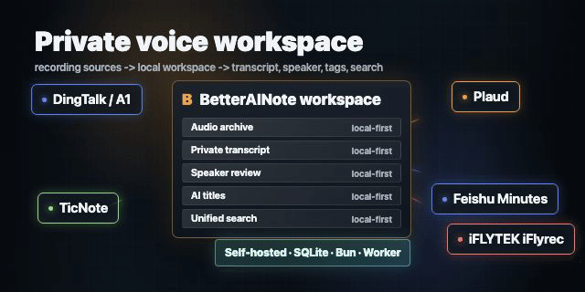
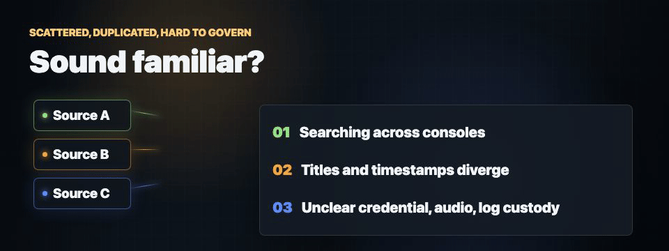
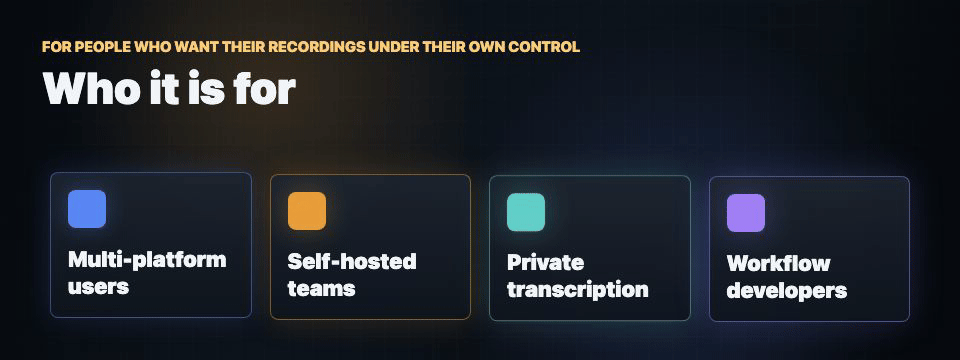
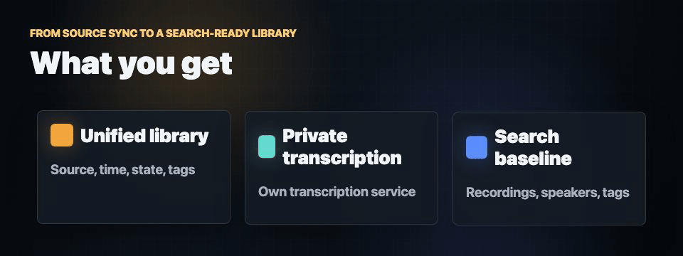
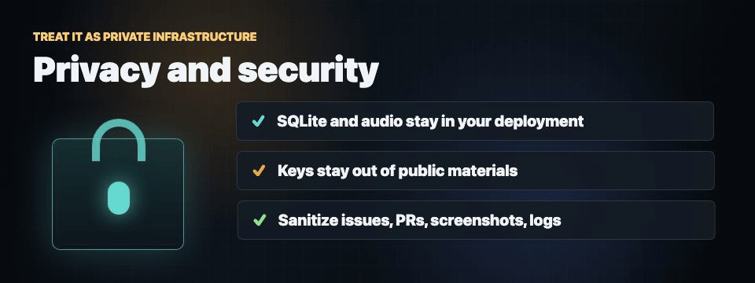
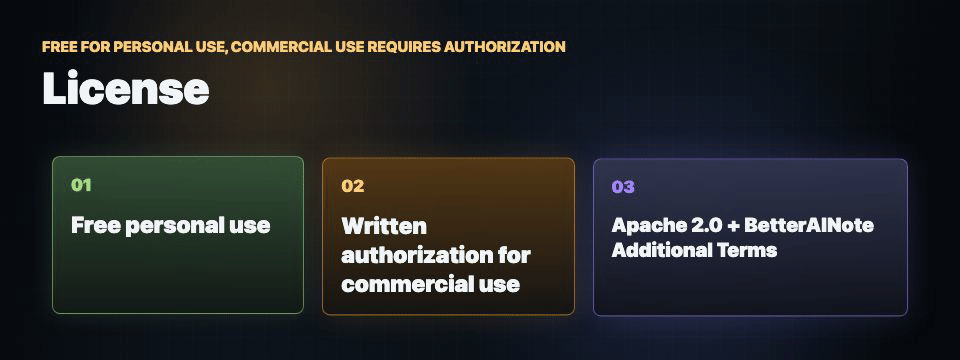

<sub>🌐 <a href="README.md">简体中文</a> · <b>English</b> · <a href="README.ja.md">日本語</a> · <a href="README.ko.md">한국어</a></sub>

<div align="center">

# BetterAINote 🎙️

> *"Bring recordings from different platforms back into a private workspace you control."*

<a href="https://github.com/MapleEve/BetterAINote/actions/workflows/ci.yml">
  
</a>
<a href="https://codecov.io/gh/MapleEve/BetterAINote">
  
</a>
<a href="https://app.fossa.com/projects/git%2Bgithub.com%2FMapleEve%2FBetterAINote">
  
</a>
<a href="https://github.com/MapleEve/BetterAINote/releases">
  
</a>
<a href="./docs/DEPLOYMENT.md">
  
</a>
<a href="./LICENSE">
  
</a>

<br>
<br>



<br>

BetterAINote brings voice records from DingTalk / A1, TicNote, Plaud, Feishu Minutes, iFLYTEK iFlyrec, and similar sources into one local workspace.<br>
The focus is **private aggregation and unified management across voice platforms**, not one vendor identity.<br>
Recordings, transcripts, speaker review, AI titles, tags, and search indexes stay around your own deployment first.<br>
Current version: `0.6.2-preview`. Self-hosting first. No npm package or public Docker image is published.

<br>

[Get started](#get-started) · [AI install/deploy](./docs/AI_INSTALL_DEPLOYMENT.md) · [Data sources](./docs/DATA_SOURCES.md) · [API](./docs/API.md) · [Deployment](./docs/DEPLOYMENT.md) · [Privacy](./docs/PRIVACY.md)

</div>

---

## Sound familiar?

<p align="center">
  
</p>

Meeting recordings live in different vendor consoles. Titles are inconsistent, downloads work differently, and finding one meeting means jumping across several websites.

Transcription, renaming, speaker cleanup, and source notes often use different tools. It is not always clear where credentials, audio files, database rows, and logs end up.

BetterAINote fixes that: **it brings multi-source recordings into a private workspace where sync, archiving, private transcription, speaker review, AI renaming, and search preparation are built around your local data.**

---

## Who it is for

<p align="center">
  
</p>

- People already using DingTalk / A1, TicNote, Plaud, Feishu Minutes, iFLYTEK iFlyrec, or similar recording platforms.
- Users who want their recording library, SQLite databases, service credentials, and audio archive on machines or servers they control.
- Teams that want VoScript or another private transcription service instead of sending every recording through a third-party cloud pipeline.
- Developers who want a self-hosted foundation before connecting more workflows or private automation.

BetterAINote is an independent project. Plaud is one supported source, not the product identity.

---

## Current status

| Area | Status |
| --- | --- |
| Stage | `preview`, built for self-hosters and early feedback |
| Release | `0.6.2-preview` is the current preview release; stable release, npm package, and public Docker image are not published |
| Package | `package.json` remains `private: true` |
| Deployment | Local machine, home server, private server, or container environment you control |
| Compatibility | API shape, provider capability, and settings may still change before the first stable release |

---

## Get started

```bash
bun install
cp .env.example .env.local
bun run db:migrate
bun run dev
```

`bun run dev` starts both the Next.js web app and the background worker. Use `bun run dev:web` for web only, or `bun run worker` when you need to run the worker separately.

Open `http://localhost:3001`, create the first admin account, then configure:

- `Data Sources`: connect DingTalk, TicNote, Plaud, Feishu Minutes, iFLYTEK iFlyrec, and similar recording sources.
- `VoScript`: configure your private transcription service URL and API key.
- `Transcription`: set shared transcription behavior.
- `AI Rename`: configure title generation and source write-back behavior.
- `Sync` / `Playback` / `Display`: tune sync, playback, and interface preferences.

Do not commit `.env.local`, databases, audio archives, account screenshots, or real credentials. Full setup details: [Deployment](./docs/DEPLOYMENT.md).

---

## What you get

<p align="center">
  
</p>

**Unified recording workspace**

- Multi-source recordings in one local library.
- Organize by source, title, time, transcript state, sync state, and tags.
- Local audio archive backed by your disk or mounted storage.

**Private transcription and speaker review**

- Connect VoScript or another private transcription service.
- Review transcript state, local transcript output, speaker labels, and reusable speaker profiles.
- Keep source records, private transcripts, and AI-generated titles in separate lanes.

**Search-ready storage foundation**

- SQLite storage is separated for settings, recording library, transcripts, voiceprints, word timing, and search indexes.
- Search covers recordings, transcripts, speakers, and tags.
- Future versions will build search, filters, and automation on this foundation.

---

## Supported sources

| Source | User-facing status |
| --- | --- |
| DingTalk / A1 | Syncs accessible recordings with the credentials configured in settings. Source detail, audio, and summary availability depend on the account. |
| TicNote | Supports China / international regions. Can sync records, archive available audio, and attempt title write-back when enabled. |
| Plaud | Supported as a recording source. Can sync visible records and archive available audio; later syncs can try to fill missing local audio for existing records when the source still provides it. |
| Feishu Minutes | Can inspect or sync source metadata, transcripts, and summaries when account permissions allow. |
| iFLYTEK iFlyrec | Focused on transcript record import and review. Audio and write-back depend on what the source exposes. |

Providers do not expose identical fields or capabilities. See [Data Sources](./docs/DATA_SOURCES.md).

---

## Privacy and security

<p align="center">
  
</p>

BetterAINote can contain recording titles, source records, transcripts, speaker names, audio files, credentials, and service keys. Treat the deployment as private infrastructure.

- Local SQLite files and `LOCAL_STORAGE_PATH` may contain sensitive recording and transcript data.
- Provider credentials, VoScript credentials, AI title service keys, and session state should stay inside your private deployment.
- Logs, issues, pull requests, screenshots, and recordings must be sanitized before public sharing.
- Do not publish cookies, bearer tokens, org/user/recording IDs, meeting content, capture files, full environment files, or machine-specific paths.

See [Privacy](./docs/PRIVACY.md) and [Security](./SECURITY.md).

---

## Documentation

| Topic | Link |
| --- | --- |
| Project overview | [README.en.md](./README.en.md) |
| AI install/deploy | [docs/AI_INSTALL_DEPLOYMENT.md](./docs/AI_INSTALL_DEPLOYMENT.md) |
| API shape and public boundary | [docs/API.md](./docs/API.md) |
| Data source maturity | [docs/DATA_SOURCES.md](./docs/DATA_SOURCES.md) |
| Deployment | [docs/DEPLOYMENT.md](./docs/DEPLOYMENT.md) |
| Privacy | [docs/PRIVACY.md](./docs/PRIVACY.md) |
| Changelog | [CHANGELOG.md](./CHANGELOG.md) |

Keep real credentials, private recordings, full transcripts, databases, private source data, and local test data out of public docs.

---

## Contributing

Issues and PRs are welcome. Keep public reports sanitized:

- Share only redacted logs, request shape, status code, and minimal reproduction steps.
- Do not upload databases, recordings, full transcripts, capture files, real source details, logged-in screenshots, or complete environment files.
- Use GitHub private security reporting for unpatched vulnerabilities.
- Keep BetterAINote provider-neutral and independent.

Read [CONTRIBUTING.md](./CONTRIBUTING.md) first.

---

## License

<p align="center">
  
</p>

Free for personal use. Commercial use requires prior written authorization.

BetterAINote uses the **BetterAINote Additional Terms on top of Apache License 2.0**. This is not the unmodified standard Apache-2.0 SPDX license. See [LICENSE](./LICENSE).
