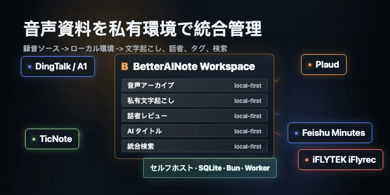
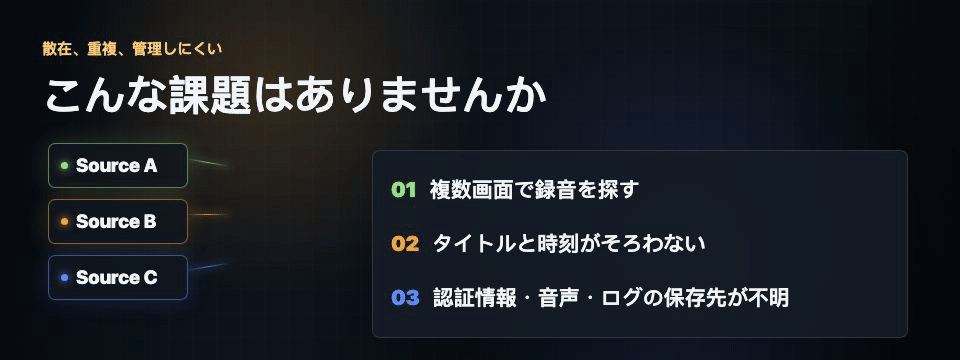
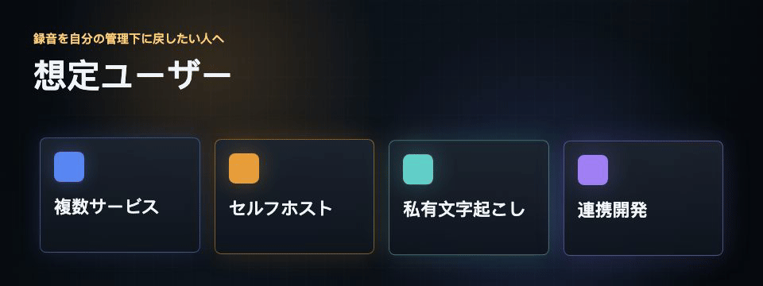
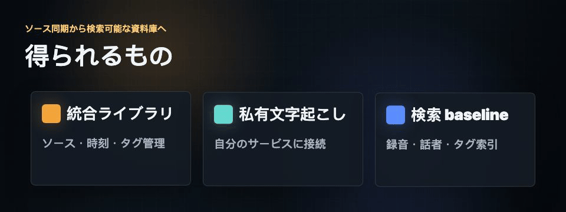
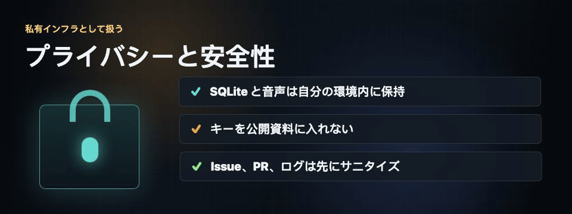
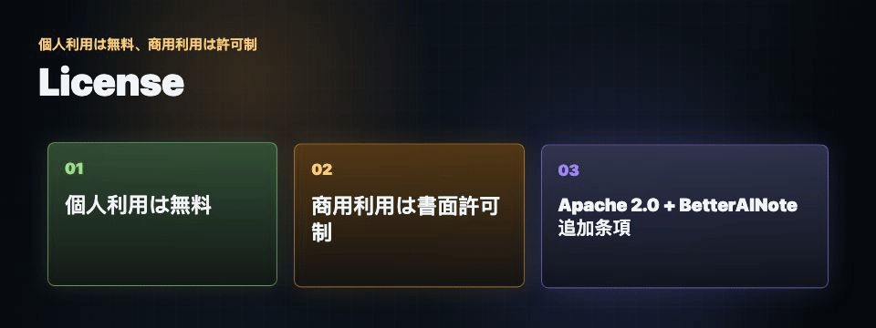

<sub>🌐 <a href="README.md">简体中文</a> · <a href="README.en.md">English</a> · <b>日本語</b> · <a href="README.ko.md">한국어</a></sub>

<div align="center">

# BetterAINote 🎙️

> *「複数サービスに散らばった録音を、自分で管理できる私有ワークスペースへ。」*

<a href="https://github.com/MapleEve/BetterAINote/actions/workflows/ci.yml">
  
</a>
<a href="https://codecov.io/gh/MapleEve/BetterAINote">
  
</a>
<a href="https://app.fossa.com/projects/git%2Bgithub.com%2FMapleEve%2FBetterAINote">
  
</a>
<a href="https://github.com/MapleEve/BetterAINote/releases">
  
</a>
<a href="./docs/DEPLOYMENT.md">
  
</a>
<a href="./LICENSE">
  
</a>

<br>
<br>



<br>

BetterAINote は DingTalk / A1、TicNote、Plaud、Feishu Minutes、iFLYTEK iFlyrec などの録音を、1 つのローカルワークスペースに集約します。<br>
重点は、1 社のサービスではなく、**複数プラットフォームの音声資料を私有環境で集約し、統一管理すること**です。<br>
録音、文字起こし、話者レビュー、AI タイトル、タグ、検索インデックスは、まず自分のデプロイ環境を中心に扱います。<br>
現在のバージョンは `0.6.2-preview` です。セルフホスト優先で、npm パッケージや公開 Docker イメージは配布していません。

<br>

[はじめかた](#はじめかた) · [AI install/deploy](./docs/AI_INSTALL_DEPLOYMENT.md) · [Data sources](./docs/DATA_SOURCES.md) · [API](./docs/API.md) · [Deployment](./docs/DEPLOYMENT.md) · [Privacy](./docs/PRIVACY.md)

</div>

---

## こんな課題はありませんか

<p align="center">
  
</p>

会議録音が複数のベンダー画面に散らばり、タイトルもダウンロード方法もばらばらです。1 つの会議を探すだけで複数サイトを行き来します。

文字起こし、リネーム、話者整理に別々のツールを使っていると、認証情報・音声・データベース・ログがどこに残るのか見えにくくなります。

BetterAINote はこの問題を解決します。**複数ソースの録音をプライベートなワークスペースに取り込み、同期、保存、私有文字起こし、話者レビュー、AI リネーム、検索準備をローカルデータ中心で扱います。**

---

## 想定ユーザー

<p align="center">
  
</p>

- DingTalk / A1、TicNote、Plaud、Feishu Minutes、iFLYTEK iFlyrec などを使っている人。
- 録音ライブラリ、SQLite データベース、サービス認証情報、音声アーカイブを自分のマシンやサーバーに置きたい人。
- VoScript などの私有文字起こしサービスを使い、すべてを外部クラウドに流したくないチーム。
- まずセルフホスト基盤を作り、その後にワークフローや自動化機能を接続したい開発者。

BetterAINote は独立したプロジェクトです。Plaud は対応ソースの 1 つであり、プロダクトの中心ではありません。

---

## 現在の状態

| 項目 | 状態 |
| --- | --- |
| フェーズ | `preview`。セルフホスト利用者と早期フィードバック向け |
| リリース | `0.6.2-preview` が現在の preview release。安定版、npm パッケージ、公開 Docker イメージは未公開 |
| パッケージ | `package.json` は `private: true` のまま |
| デプロイ | 自分で管理するローカルマシン、ホームサーバー、私有サーバー、コンテナ環境 |
| 互換性 | 初回安定版までは API、provider 機能、設定項目が変わる可能性があります |

---

## はじめかた

```bash
bun install
cp .env.example .env.local
bun run db:migrate
bun run dev
```

`bun run dev` は Next.js Web app とバックグラウンド worker の両方を起動します。Web だけを起動する場合は `bun run dev:web`、worker だけを起動する場合は `bun run worker` を使います。

`http://localhost:3001` を開き、最初の管理者アカウントを作成してから設定します。

- `Data Sources`: 録音ソースを接続。
- `VoScript`: 私有文字起こしサービス URL と API key を設定。
- `Transcription`: 共通の文字起こし設定。
- `AI Rename`: タイトル生成とソースへの書き戻し設定。
- `Sync` / `Playback` / `Display`: 同期、再生、表示の設定。

`.env.local`、データベース、音声アーカイブ、ログイン状態のスクリーンショット、実際の認証情報はコミットしないでください。詳細は [Deployment](./docs/DEPLOYMENT.md) を参照してください。

---

## 得られるもの

<p align="center">
  
</p>

**統合録音ライブラリ**

- 複数ソースの録音を 1 つのローカルライブラリに集約。
- ソース、タイトル、時刻、文字起こし状態、同期状態、タグで整理。
- 音声アーカイブはローカルディスクや自分で管理するマウント先に保存できます。

**私有文字起こしと話者レビュー**

- VoScript などの私有文字起こしサービスと連携。
- 文字起こし状態、ローカル文字起こし結果、話者ラベル、再利用可能な話者プロフィールを確認。
- ソース記録、私有文字起こし、AI タイトル生成を分けて扱えます。

**検索に向いた保存基盤**

- SQLite ストレージは設定、録音ライブラリ、文字起こし、声紋、単語タイミング、検索インデックスに分かれます。
- 検索は録音、文字起こし、話者、タグを対象にします。
- 今後の検索、フィルター、自動化はこの基盤の上に追加されます。

---

## 対応ソース

| ソース | 現在の利用者向け説明 |
| --- | --- |
| DingTalk / A1 | 設定された認証情報でアクセス可能な録音を同期します。詳細、音声、要約はアカウント権限に依存します。 |
| TicNote | 中国 / 国際リージョンに対応。録音同期、取得可能な音声の保存、設定時のタイトル書き戻しを扱います。 |
| Plaud | 録音ソースとして対応。表示可能な録音の同期と取得可能な音声の保存を行い、既存レコードにローカル音声がない場合は後続同期で補完を試みます。 |
| Feishu Minutes | 権限がある場合、ソースメタデータ、文字起こし、要約を確認または同期できます。 |
| iFLYTEK iFlyrec | 文字起こし記録の取り込みと確認が中心です。音声と書き戻しはソース側の提供内容に依存します。 |

詳細は [Data Sources](./docs/DATA_SOURCES.md) を参照してください。

---

## プライバシーと安全性

<p align="center">
  
</p>

BetterAINote には録音タイトル、ソース記録、文字起こし、話者名、音声ファイル、認証情報、サービスキーが含まれる可能性があります。私有インフラとして扱ってください。

- SQLite ファイルと `LOCAL_STORAGE_PATH` には機密性の高い録音・文字起こしデータが含まれる可能性があります。
- Provider 認証情報、VoScript 認証情報、AI タイトルサービスキー、セッション状態は私有デプロイ内に留めてください。
- 公開 Issue、PR、スクリーンショット、ログは必ずサニタイズしてください。
- cookie、bearer token、組織 / ユーザー / 録音 ID、会議内容、キャプチャファイル、完全な環境ファイル、ローカル私有パスを公開しないでください。

詳しくは [Privacy](./docs/PRIVACY.md) と [Security](./SECURITY.md) を参照してください。

---

## ドキュメント

| トピック | リンク |
| --- | --- |
| 概要 | [README.ja.md](./README.ja.md) |
| AI install/deploy | [docs/AI_INSTALL_DEPLOYMENT.md](./docs/AI_INSTALL_DEPLOYMENT.md) |
| API | [docs/API.md](./docs/API.md) |
| データソース | [docs/DATA_SOURCES.md](./docs/DATA_SOURCES.md) |
| デプロイ | [docs/DEPLOYMENT.md](./docs/DEPLOYMENT.md) |
| Privacy | [docs/PRIVACY.md](./docs/PRIVACY.md) |
| Changelog | [CHANGELOG.md](./CHANGELOG.md) |

公開ドキュメントには、実際の認証情報、私有録音、文字起こし全文、データベース、ソースの私有データ、ローカルテストデータを入れないでください。

---

## License

<p align="center">
  
</p>

個人利用は無料です。商用利用には事前の書面許可が必要です。

BetterAINote は **Apache License 2.0 に追加された BetterAINote Additional Terms** の下で提供されます。標準の Apache-2.0 SPDX ライセンスそのものではありません。詳細は [LICENSE](./LICENSE) を確認してください。
